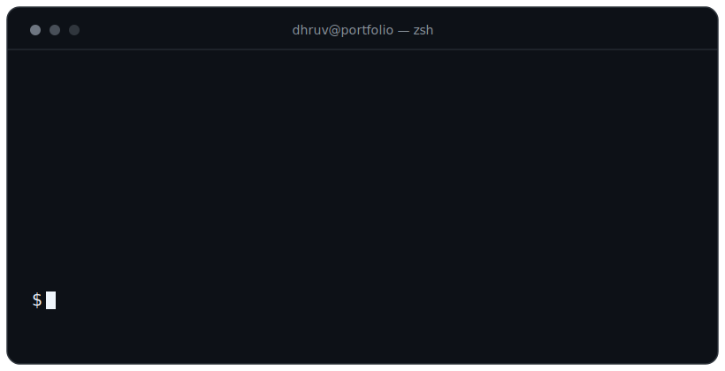

<!-- ====================== HEADER ====================== -->

<!-- ====================== ANIMATED TERMINAL (the "gif") ====================== -->

  
  
  
  

  
  
  
  

<!-- ====================== TECH STACK ====================== -->

### 🧰 Tech Stack

 

 

<!-- ====================== STATS ====================== -->

<picture>
  <source media="(prefers-color-scheme: dark)" srcset="https://raw.githubusercontent.com/dhruv-techdev/dhruv-techdev/output/github-contribution-grid-snake-dark.svg" />
  
</picture>

  

